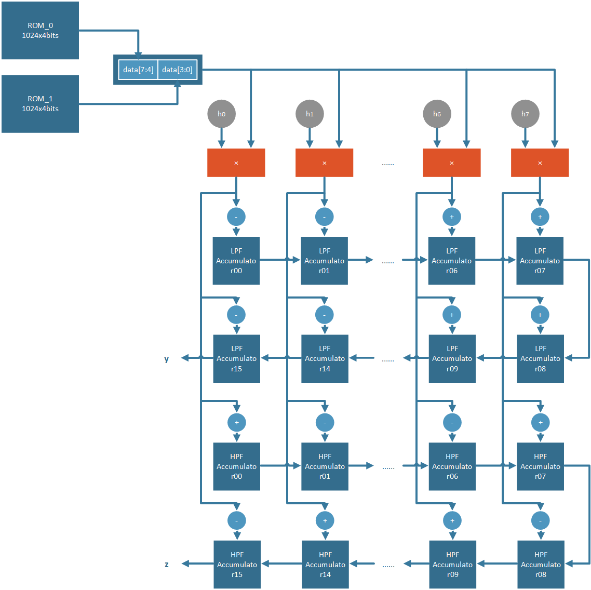
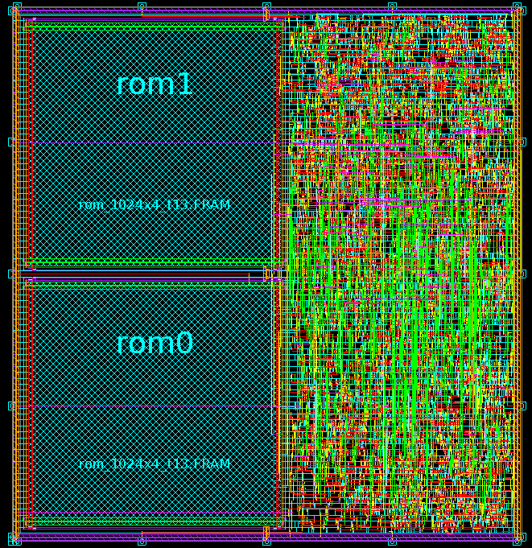

# IC Design Contest

## 2012 IC Design Contest Final Cell-Based IC Design Category for Graduate Level
- Multi-Bank Filter

## Module
- `src/MBF.v` -- Main module.

## Test Bench
- `src/testfixture1.v`
- `src/testfixture2.v`
- `src/rom_1024x4_t13_sim1.v`
- `src/rom_1024x4_t13_sim2.v`
- `src/rom_1024x4_t13_verilog1.rcf`
- `src/rom_1024x4_t13_verilog2.rcf`
- `src/LPF_golden1.dat`
- `src/LPF_golden2.dat`
- `src/HPF_golden1.dat`
- `src/HPF_golden2.dat`
- `src/pattern1.dat`
- `src/pattern2.dat`

## Algorithm
- 

## Layout
- 

## AUTHORS
[Yu-Tong Shen](https://github.com/yutongshen/)
